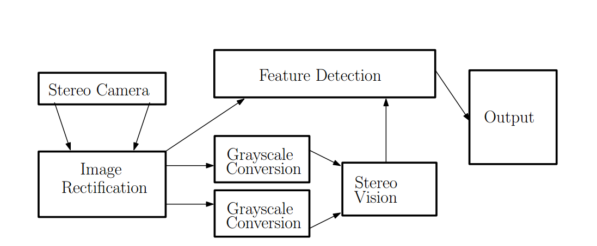

# CIS 565 Final Project Proposal

## CUDA-Accelerated Video Processing Pipeline

## Overview
Many livestreaming applications (Youtube, Facebook live, Twitch) have a need to be able to process video streams on the fly through compression, encoding, up/down sampling, stitching, and any other post-processing effects. Given the data parallel properties of some of these challenges, GPGPUs are most suited for the task. We intend to create a CUDA-accelerated real-time video processing pipeline for online use. We reference existing image processing pipelines and use it as inspiration for a novel video pipeline that will take advantage of different levels of parallelism provided by GPGPUs.

The tech stack we will be using for this project will primarily be C/C++ and CUDA. 

Below is a video pipeline that is used for computer vision and robotics. It is used as a reference example. All video pipelines have an input node and an output node which take in and output the video stream. 

## Challenges and Investigations

### Task Independent Parallelism
Using the example above, there are stages that are not necessarily dependent on eachother such as the grayscale conversion. We can then asynchronously schedule kernel launches to complete tasks in an order that maximizes throughput. This leads us to our next challenge.

### Thread Level Parallelism/Pipeline Parallelism
As each frame passes through the pipeline, a new one is immediately pushed through. As a result, the pipeline is constantly saturated with frames being processed at different stages. This and the previous level of parallelism differs from a traditional image processing pipeline as there is no software scheduling that needs to be done. A single image is processed once throughout the entire pipeline.

### Data Level Parallelism
Per kernel, we want to achieve data level parallelism for as many steps in the pipeline as possible. This is a given considering that we are doing this for GPUs and is also no less than what is expected of an image processing pipeline.

### Temporal Parallelism
The question to be asked here is how much memory bandwith and computation time do we save if we are able to cache/precompute most of our data to complement the above levels of parallelism. In a task and thread parallel pipeline, it makes a lot of sense to leverage the format of how video is represented.

### Memory Management
Since we are working with very large binary objects that are constantly being copied around, it might make sense to try leveraging Unified Memory to perform lazy copies to minimize latency. Additionally, we want to investigate the cost/benefits of Unified Virtual Addressing in a no-copy scenario (we believe it'll suck but the numbers will have to show).

## Goals/Features
 * Upsample/Downsampling
 * [Frame interpolation](https://www.wikiwand.com/en/Motion_interpolation)
 * [Chroma key compositing](https://www.wikiwand.com/en/Chroma_key)
 * Detail/Edge enhancement
 * Noise reduction
 * Brightness/Contrast/Hue/Saturation/Sharpness/Gamma adjustments
 * H.265 encoding/decoding

## References
 * http://on-demand.gputechconf.com/gtc/2012/presentations/S0328-Best-Practices-in-GPU-Based-Video-Processing.pdf
 * https://devblogs.nvidia.com/parallelforall/unified-memory-in-cuda-6/
 * http://on-demand.gputechconf.com/siggraph/2013/presentation/SG3108-GPU-Programming-Video-Image-Processing.pdf
